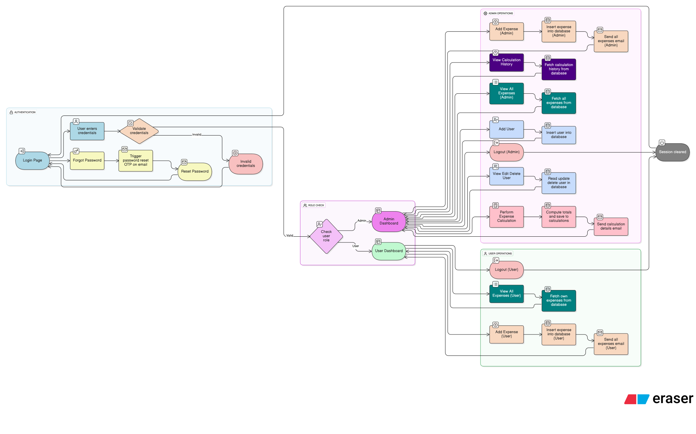
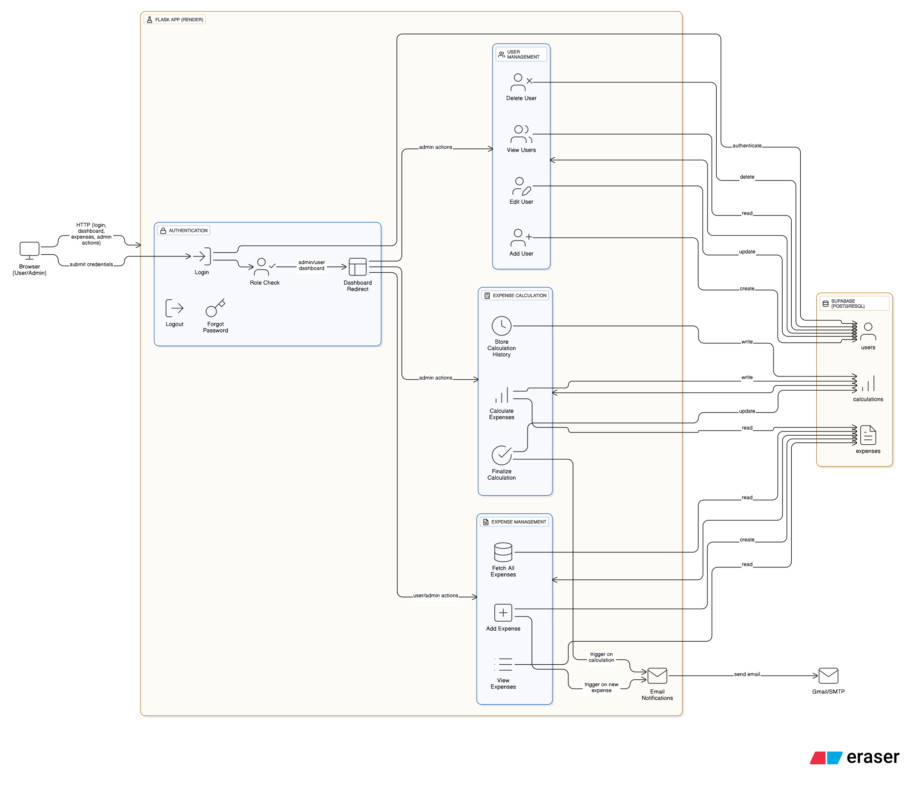

## Expense Tracker System

#### A simple and efficient Expense Tracker web application built using Python and Flask. This system allows users to track their daily expenses, categorize them, and view summaries for better financial management.
#### Designed and implemented a secure admin dashboard enabling real-time content updates.

---

## Features
```
- Add, edit, and delete expenses
- Categorize expenses (e.g., Food, Transport, Utilities)
- View expense history with filters by date and category
- Dashboard summary with total expenses
- User-friendly and clean interface
```
---

## Flow Chart

Here’s the user flow of the application:



---

## High-Level System Design

This diagram shows the overall architecture of the Expense Tracker System, including
frontend, backend, database, and email notification flows:


---

## 🧰 Tech Stack
```
- **Frontend:** HTML5, CSS3, Bootstrap 5
- **Backend:** Python, Flask
- **Database:** Supabase (PostgreSQL)
- **Deployment:** Render
```
---

## 📁 Project Structure

```
Expense-Tracker-System/
├── app.py # Main Flask application
├── supabase_client.py # Supabase client connection
├── send_mail.py # Email sending logic
├── requirements.txt # List of Python dependencies
├── Procfile # For deployment on Render/Heroku
├── templates/ # HTML templates
│ ├── add_expense.html
│ ├── admin_dashboard.html
│ ├── base.html
│ ├── calculations.html
│ ├── calculations_history.html
│ ├── edit_expense.html
│ ├── edit_user.html
│ ├── email_parser.html
│ ├── login.html
│ ├── register.html
│ ├── user_dashboard.html
│ ├── view_expense.html
│ └── view_users.html
├── static/
│ ├── css/ # Stylesheets
│ ├── fonts/ # Fonts used
│ ├── img/ # Images
│ └── js/ # JavaScript files
└── README.md # Project documentation
```
---

## Contact
```
For any questions or feedback, reach out to:
  * Author: Shailesh Kumar Vishwakarma
  * Email: shailvestein.careers@gmail.com
  * GitHub: shailvestein
```
